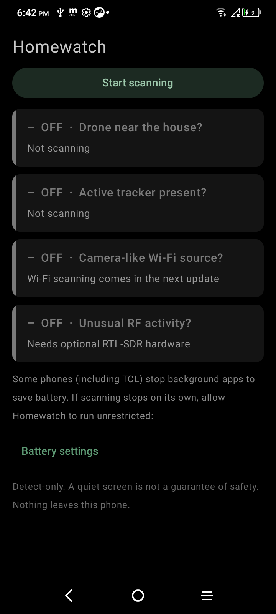

# Homewatch for Android
Detect-only home counter-surveillance for Android. Sister project of [homewatch](https://github.com/sloppytopp/homewatch) (Linux).
It listens for **Remote ID drones** and **separated Bluetooth trackers** (Apple Find My / AirTag, Tile, Samsung SmartTag, Chipolo)
using only the phone's own Bluetooth radio. **No account, no cloud, no analytics - nothing leaves the phone.** It never jams, spoofs or transmits.

## Status: v0.5
- [x] Dark, low-glare UI (true black, muted colors; every status is word + icon + color) and a **night mode** (dim red on black)
- [x] Bluetooth LE scanner: Remote ID drones, separated Apple Find My / Tile / SmartTag / Chipolo trackers (foreground service, soft chime / vibrate / silent - never a voice)
- [x] Wi-Fi scanning: Remote ID beacons, drone-like and camera-like networks (name + vendor tables)
- [x] Proximity radar (rough, honestly labelled) and a drone map with real Remote ID positions vs your home; demo-drone preview
- [x] Home location: phone GPS, address search (Android's lookup service, checked against GPS), or typed numbers - stored on the phone only
- [x] On-device history (30 days), "I heard my sensor beep" log and report with a background baseline, delete-all button
- [x] **Nearby** tab: every Wi-Fi network and (optionally) every Bluetooth device in a list with signal bars; tap a network to mark it yours
- [x] **Tap-to-find**: tap a flagged tile or the alert notification -> hot/cold meter, warmer/colder arrow, turn-in-place compass sweep (trackers), GPS + compass arrow with distance (drones that broadcast a position), Wi-Fi source meter
- [x] **"This is mine"** for your own trackers (they stop flagging and show green), and a real compass dial (smoothed heading, calibration hint) in the finders
- [x] **Survey walk + exports**: log Wi-Fi/tracker sightings with GPS while you walk, see a local map with rough source positions (refuses to guess if you didn't really move), save a **KML** for Google Earth or a **WiGLE-format CSV** - exports are local files only, nothing uploads; Wi-Fi detail dialog copies a MAC and opens wigle.net so you can check how long a network has been around
- [x] **Room sweeps**: sweep each room for 45 s to build a baseline, re-sweep to spot NEW devices, and see which room a device is probably in (no GPS)
- [x] **Discreet mode**: generic notifications hidden on the lock screen, hidden from recents/screenshots, optional PIN lock, launcher name+icon disguise (Notes / Weather), one-tap quick exit
- [x] "Is it working?" feedback: breathing dot, live counts and scan ages, plain-language banner, guided 30-second sweep, first-run welcome, night switch on every screen
- [x] 47 unit tests (same packet fixtures as the Linux tool)
- [ ] Optional RTL-SDR support; one-time "Pro" extras. Core detection stays free.

## Read this first
- **Not a guarantee of safety.** A quiet screen means "nothing seen by this radio". Drones without Remote ID, SD-card cameras and cellular trackers are invisible to a phone.
- **Remote ID is unauthenticated.** Anyone can fake it, so an alert means a broadcast *claims* a drone. Operator coordinates are shown live and never stored.
- **Do not interfere with a drone** (shooting at or jamming one is a federal crime). Report it to law enforcement or the FAA.
- Apple "owner nearby" Find My signals are ignored on purpose: only *separated* trackers, and only when persistent and close, raise an alert.
- Android 11 and older only deliver Bluetooth scan results while the Location switch is on; Homewatch does not read, save or send location.
- Some phones kill background apps aggressively; the app links to battery settings. Tested on a TCL 5087Z, Android 11. Wi-Fi scans are throttled by Android (about 4 per 2 minutes) and need the Location switch on.

## Build
JDK 17 + Android SDK (platform 35). `./gradlew assembleDebug testDebugUnitTest`, then `adb install -r app/build/outputs/apk/debug/app-debug.apk`.

MIT licensed. Design notes: [docs/design.md](docs/design.md).
