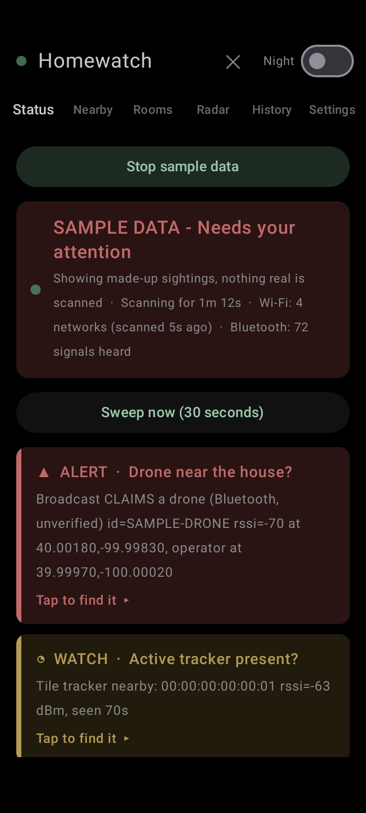
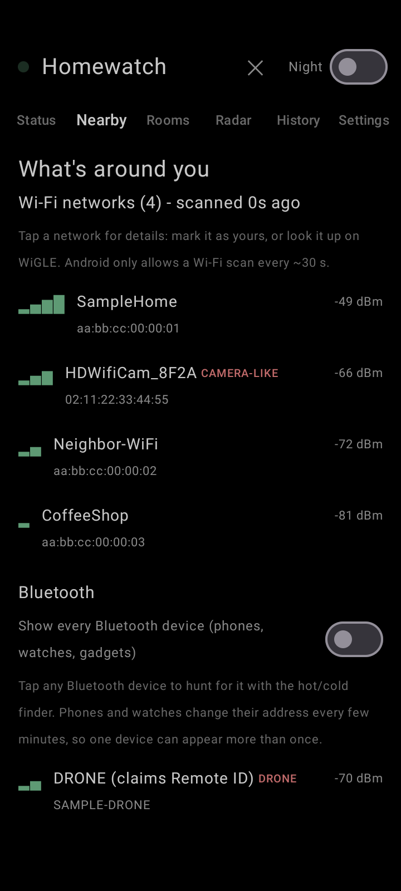
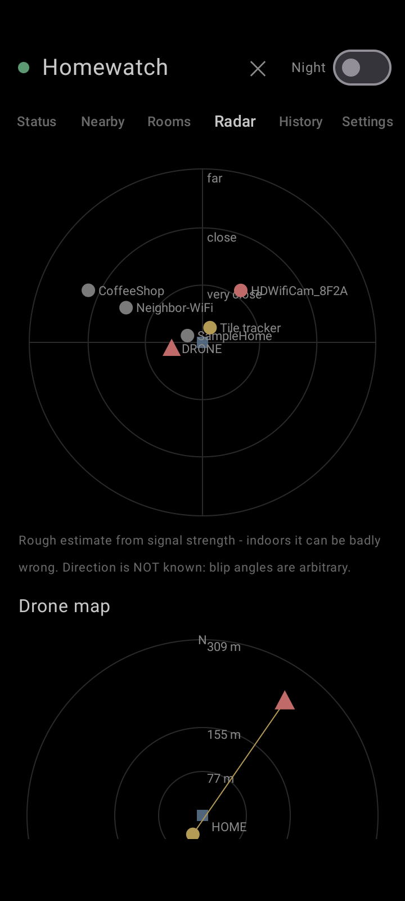
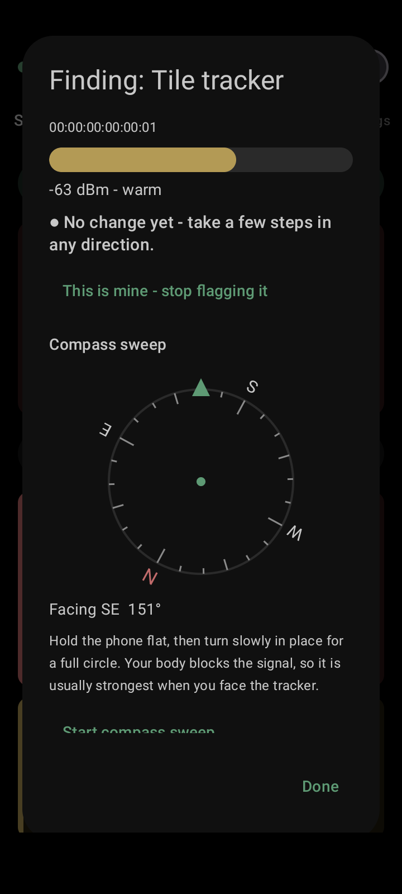

# N0RMA for Android

**Check whether anything nearby is tracking or watching you - using only your phone's own radios. Nothing leaves your phone.**

Detect-only. No account, no cloud, no ads, no analytics, and no internet permission at all.

<p>




</p>

_All screenshots use the built-in sample data - no real networks or places._

## What it does
- **Trackers**: finds Bluetooth trackers separated from their owner (Apple Find My / AirTag-style, Tile, Samsung SmartTag, Chipolo). Normal "owner nearby" signals are ignored on purpose.
- **Drones**: listens for FAA **Remote ID** broadcasts over Bluetooth and Wi-Fi - worded as *claims*, because Remote ID can be faked.
- **Camera-like Wi-Fi**: flags networks that look like cameras or drones (by name and maker).
- **Smart devices**: groups nearby gadgets by maker (Amazon, Google, Samsung, cameras, plugs) and walks you through the Sidewalk / Ring / Alexa privacy settings.
- **TSCM-style tools**: a physical-inspection checklist per room, a camera-lens finder (torch + dark-room glint detection), and a sweep report that lists what was and was **not** checked.
- **One plain answer** - "All clear" / "Keeping an eye on something" / "Needs your attention" - with live proof it is working (heartbeat, scan ages, counts).
- **Tap-to-find**: tap an alert for a hot/cold meter, a warmer/colder arrow, a real compass sweep (trackers), or a GPS + compass arrow with distance (drones that broadcast a position).
- **Room sweeps**: baseline each room, spot what is *new*, and see which room a device is probably in - without GPS.
- **Survey walks**: log what you hear while you walk, see rough source positions, and save a **KML** (Google Earth) or **WiGLE-format CSV**. Files are saved locally; nothing uploads.
- **"This is mine"** for your own trackers, so they stop flagging.
- **Calm by design**: true-black, low-glare screens and a dim-red night mode, so searching at night does not light up the street. Status is always word + icon + colour.
- **Discreet mode**: neutral notifications hidden on the lock screen, PIN lock, hidden from recent apps and screenshots, a Notes/Weather launcher disguise, one-tap quick exit.
- **"Try it with sample data"**: see every screen work (clearly labelled, nothing real scanned) before you trust it.

## How it compares
Honest answer: tracker detection alone is already well covered.
- [**AirGuard**](https://github.com/seemoo-lab/AirGuard) (TU Darmstadt, open source) is excellent at tracking *you* over time with AirTags, SmartTags and Google trackers, and Google and Apple ship built-in unknown-tracker alerts. Use them too.
- Open-source Remote ID scanner apps exist for drones.

N0RMA is not another AirTag finder. It is the **one place** that looks at trackers, drones and camera-like networks together, tells you in plain words what it found, **walks you to it**, checks it **room by room**, and exports a **survey** - in a calm interface made for being used at night, possibly under stress.

## Read this first
- **Not a guarantee of safety.** A quiet screen means "nothing seen by this radio". A phone cannot see drones without Remote ID, cameras that only record to an SD card, cellular/GPS trackers, or most hidden devices.
- **Remote ID is unauthenticated.** Anyone can fake it; an alert means a broadcast *claims* a drone. Operator positions are shown live and never saved.
- **Distance and direction are rough.** Signal strength gives a crude distance, badly distorted by walls and the phone's antenna, and no direction on its own. Survey estimates need a real outdoor walk; GPS drifts indoors.
- **Do not interfere with a drone** (shooting at or jamming one is a federal crime in the US). Report it to law enforcement or the FAA.
- **If you find something you don't own**, leave it in place, photograph it, and contact local law enforcement.
- **If you feel unsafe** (for example because of a stalker or abusive partner), contact local police or a hotline. In the US: National Domestic Violence Hotline, 1-800-799-7233.
- **WiGLE is public.** Uploading a survey puts the networks you heard - including your own - and where you walked on a public map. Don't upload surveys made near a home you want to keep private.
- Android only allows a few Wi-Fi scans per couple of minutes and needs the Location switch on (N0RMA does not read, save or send your location). Some phones stop background apps to save battery; the app links to the battery settings.

## Download
Only use the official sources below. Other "APK sites" can host modified copies, which matters for a privacy tool.

| Source | How |
|---|---|
| **GitHub Releases** (official) | Download `n0rma-<version>.apk` from the [latest release](../../releases/latest) |
| **Obtainium** (auto-updates from GitHub) | [Add N0RMA to Obtainium](https://apps.obtainium.imranr.dev/redirect?r=obtainium://add/https://github.com/sloppytopp/n0rma-android) - or in Obtainium tap **Add App** and paste `https://github.com/sloppytopp/n0rma-android` |
| **F-Droid** | [merge request open](https://gitlab.com/fdroid/fdroiddata/-/merge_requests/51294) (under review) |

Requires Android 8+ and a phone with Bluetooth LE. Tested on a TCL 5087Z (Android 11). After installing, tap **Try it with sample data** to see every screen work before trusting it with anything real.

### Verify your download
Each release lists two values you can check:
```
sha256sum -c n0rma-<version>.apk.sha256                 # file is intact
apksigner verify --print-certs n0rma-<version>.apk      # signer must match the fingerprint below
```
Official signing certificate SHA-256:
`ba208cc13101a7c8d4e8fa4d8016e5b333bd522d64c71d2a723179410f049c22`
If the fingerprint is different, it is not an official build - don't install it.

## Permissions
| Permission | Why |
|---|---|
| Bluetooth scan / Nearby devices | Listen for trackers and Remote ID drones |
| Location | Required by Android 11 and older for Bluetooth/Wi-Fi scanning; used on request for your home position and survey walks. Never uploaded |
| Nearby Wi-Fi devices (Android 13+) | Scan Wi-Fi networks |
| Foreground service, notifications, vibrate | Keep scanning in the background; soft chime/vibrate alerts (never a voice) |
| Camera | Only for the Lens finder, only while you have it open: torch + camera to spot lens glints. Pictures are analysed in memory and discarded; nothing is saved or sent. Optional: deny it and the rest works |

No internet permission. See [PRIVACY.md](PRIVACY.md).

## Build
JDK 17 + Android SDK 35: `./gradlew assembleDebug testDebugUnitTest` (49 JUnit tests over the radio parsing and detection logic), then `adb install -r app/build/outputs/apk/debug/app-debug.apk`.
Release builds read signing details from an untracked `keystore.properties`; without it the release APK is unsigned (which is what F-Droid needs).

## Related
- [n0rma](https://github.com/sloppytopp/n0rma) - the Linux sibling (`pip install n0rma`) with the same detection, plus RTL-SDR support.

## Contributing, security, license
See [CONTRIBUTING.md](CONTRIBUTING.md) and [SECURITY.md](SECURITY.md). How it works and what it cannot do: [docs/METHODOLOGY.md](docs/METHODOLOGY.md). Design notes: [docs/design.md](docs/design.md). MIT licensed.
